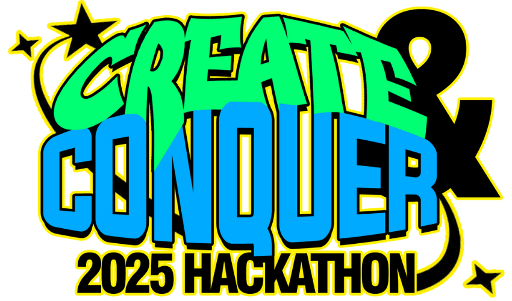

# CREATE & CONQUER 2025 Hackathon

## About
CREATE & CONQUER 2025 is the inaugural hackathon organized by the FEU Institute of Technology's Computer Engineering Organization (CPEO). This event brings together students, visionary thinkers, and developers from across Metro Manila and the Philippines to collaborate, innovate, and solve real-world challenges.

## Event Details
- **Dates**: June 27 - July 5, 2025
- **Location**: FEU Tech Innovation Center, Manila
- **Format**: Hybrid (In-person & Online options)
- **Registration**: June 9 - June 23, 2025
- **Prize Pool**: ₱9,500

## Key Features
- Open to all skill levels - no coding experience needed!
- Team size: 4-6 members
- Eligibility: Junior High School, Senior High School, and undergraduate students in the Philippines
- Early bird & regular pricing options available

## Website Content
This React website includes:
- Home page with event highlights and countdown timer
- About page with detailed information about the hackathon
- Registration page for participants
- Event details page with schedule and format information
- Rules and guidelines
- Judging criteria
- Resources for participants
- Contact information

## Tech Stack
- React 
- React Router for navigation
- Vite for fast development and building

## Development
This project was created using Vite and React. To run the project locally:

```bash
# Install dependencies
npm install

# Start the development server
npm run dev

# Build for production
npm run build
```

## Organized By
- Computer Engineering Organization (CPEO) - FEU Tech
- FEU Tech Innovation Center
